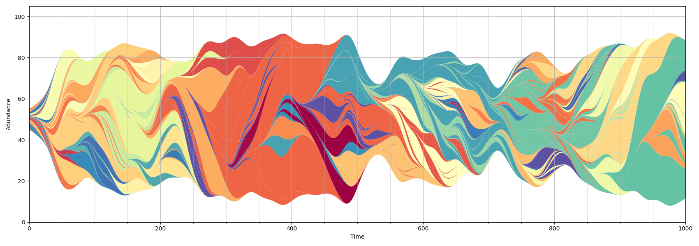
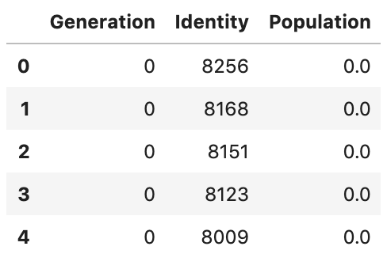
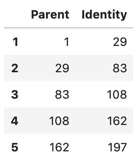

# MullerPy
Muller plot generation in Python


## Installation

    pip install pymuller
    
## Usage

```python
from pymuller import muller

muller(populations_df, adjacency_df)
```


The *muller* function takes two mandatory arguments:  
  
**populations_df:** A Pandas dataframe with the following structure:  



**adjacency_df:** A Pandas dataframe containing the population adjacency information. Every strain except the ancestral one must have a row.



Optional arguments:

*smoothing_std* - To smooth things up, a rolling average with a gaussian kernel is applied to each strain frequencies variable. This parameter can be used to control the degree of smoothness.
  
*ax* - an existing Matplotlib axis to plot on.